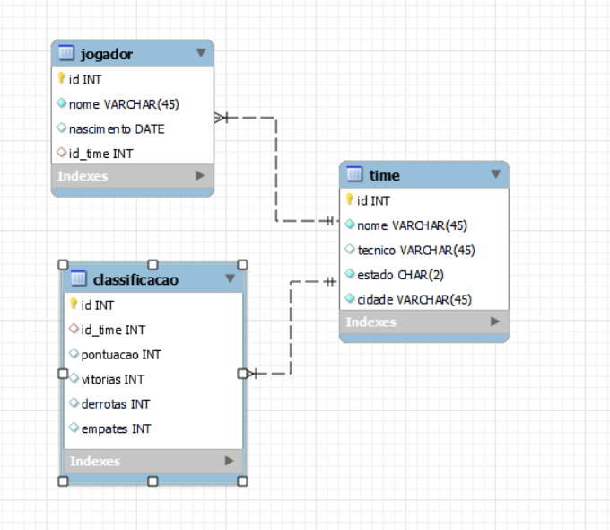

## Aplicação gráfica com Java e Swing

Desenvolvimento de uma aplicação gráfica desktop com Java e Swing  para a contrução de um campeonato, com os times, jogadores e classificação dos times no campeonato. Foi também utilizado um banco de dados MySQL para a persistência dos dados.

Para cada uma das entidades do projeto (jogador, time e classificação) o projeto possui duas janelas. Uma janela "Atualizar" com as funcionalidades de consulta, inclusão, atualização e exclusão dos registros da entidade do banco de dados e uma janela "Lista" onde é possui ver uma lista de todos os registros da entidade cadastrados. Ainda na janela "Atualizar" de Time, quando é feita uma consulta do Time é possível ver uma lista de todos os jogadores associados a este time na mesma tela.

Projeto desenvolvido durante a disciplina de Programação I.

## Modelagem do banco



## Estrutura do projeto

```
───src
│   └───br
│       └───senac
│             └───rj
│                  └───banco
│                       ├───janelas
│                       ├───modelo
│                       └───teste
```

No pacote `janelas` estão todas as janelas acessórias do projeto, que estão localizadas no menu superior da janela principal, duas janelas para cada uma das entidades do projeto.

No pacote `modelo` estão todas as entidades do projeto (Jogador, Time e Classificação) e o arquivo `Conexao.java` responsável pela conexão com o banco de dados MySQL.

No pacote `teste` está disponível a janela Principal do programa.
